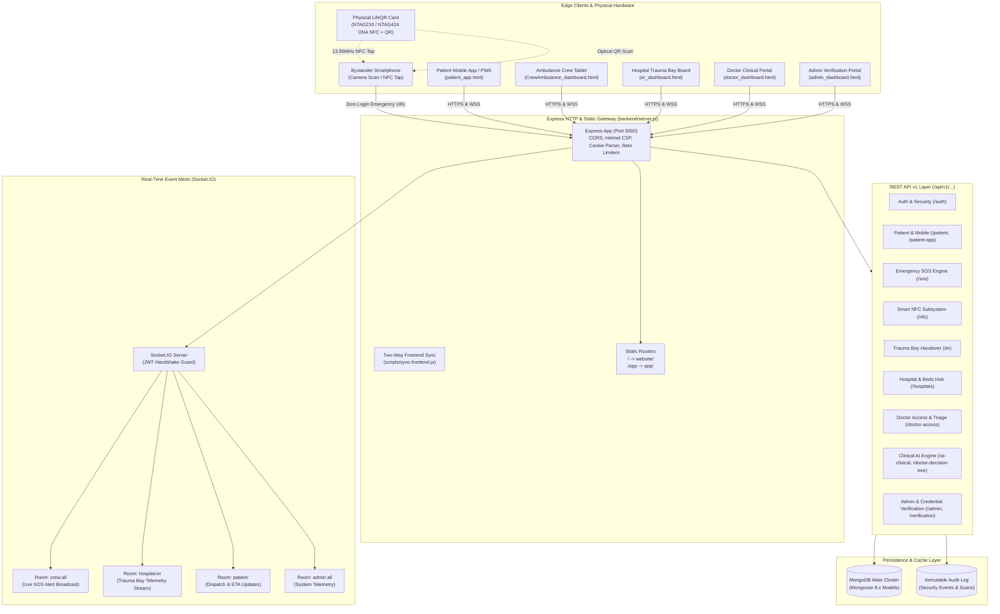
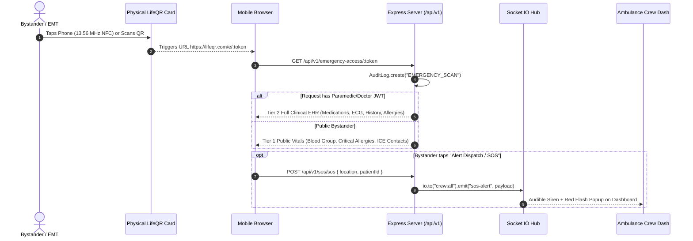
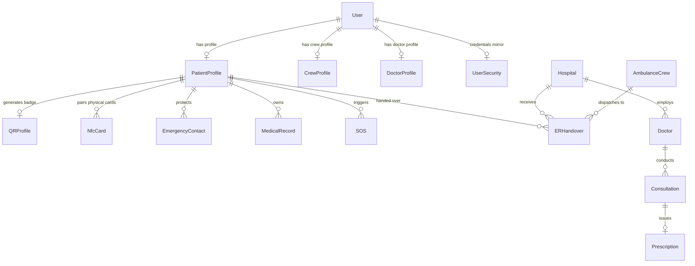

# Architecture — LifeQR Technical System Design

> **Document Scope**: End-to-end technical system design, runtime topology, data flow, real-time dispatch mesh, security controls, and schema relationships for the LifeQR Emergency Medical Platform.

---

## 📑 Table of Contents

- [🏛️ 1. High-Level System Topology](#-1-high-level-system-topology)
  - [1.1. Topology Architecture Diagram](#11-topology-architecture-diagram)
  - [1.2. Architecture Diagram Node to File Directory](#12-architecture-diagram-node-to-file-directory)
- [📁 2. Directory & Separation of Concerns](#-2-directory--separation-of-concerns)
  - [2.1. Website Landing Directory (`website/`)](#21-website-landing-directory-website)
  - [2.2. Application Portals Directory (`app/`)](#22-application-portals-directory-app)
  - [2.3. Client JavaScript Controllers (`app/js/`)](#23-client-javascript-controllers-appjs)
  - [2.4. Backend Node.js Engine (`backend/`)](#24-backend-nodejs-engine-backend)
  - [2.5. Smart Emergency NFC Card Module (`nfc-card/`)](#25-smart-emergency-nfc-card-module-nfc-card)
  - [2.6. Build, Automation & Sync Scripts (`scripts/`)](#26-build-automation--sync-scripts-scripts)
  - [2.7. Persistent Memory & Knowledge Base (`brain/`)](#27-persistent-memory--knowledge-base-brain)
  - [2.8. Root Project Specifications & Configs](#28-root-project-specifications--configs)
- [⚙️ 3. Backend Architecture & API Pipeline](#-3-backend-architecture--api-pipeline)
  - [3.1. Middleware Execution Pipeline](#31-middleware-execution-pipeline)
  - [3.2. REST Routing Table (`/api/v1/...`)](#32-rest-routing-table-apiv1)
- [⚡ 4. Real-Time Event Mesh (Socket.IO Architecture)](#-4-real-time-event-mesh-socketio-architecture)
  - [4.1. Handshake Authentication & Server Rooms](#41-handshake-authentication--server-rooms)
  - [4.2. Real-Time Event Catalogue](#42-real-time-event-catalogue)
- [🚑 5. Emergency Lifecycles & Golden Hour Workflows](#-5-emergency-lifecycles--golden-hour-workflows)
  - [5.1. Workflow A: Contactless NFC Tap & QR Scan](#51-workflow-a-contactless-nfc-tap--qr-scan-dual-tier-access)
  - [5.2. Workflow B: Offline Zero-Connectivity Fallback](#52-workflow-b-offline-zero-connectivity-fallback)
- [💾 6. Database Schemas (MongoDB Mongoose Catalog)](#-6-database-schemas-mongodb-mongoose-catalog)
  - [6.1. Entity Relationship Model](#61-entity-relationship-model)
  - [6.2. Schema Summary Table](#62-schema-summary-table)
- [🔒 7. Security, Cryptography & Networking Standards](#-7-security-cryptography--networking-standards)

---

## 🏛️ 1. High-Level System Topology

### 1.1. Topology Architecture Diagram



### 1.2. Architecture Diagram Node to File Directory

| Diagram Node | Technical Role | Implementation File / Link |
| :--- | :--- | :--- |
| **`MobileUser`** | Patient Mobile MVP Web Shell | [app/patient_app.html](file:///c:/Users/tarun/Downloads/lifeqr-complete/app/patient_app.html) & [app/js/patient-app.js](file:///c:/Users/tarun/Downloads/lifeqr-complete/app/js/patient-app.js) |
| **`PublicUser`** | Zero-Login Emergency Profile | [app/emergency_access.html](file:///c:/Users/tarun/Downloads/lifeqr-complete/app/emergency_access.html) & [app/js/emergency-access.js](file:///c:/Users/tarun/Downloads/lifeqr-complete/app/js/emergency-access.js) |
| **`CrewUnit`** | Ambulance Telemetry & Scanner | [app/CrewAmbulance_dashboard.html](file:///c:/Users/tarun/Downloads/lifeqr-complete/app/CrewAmbulance_dashboard.html) & [app/js/crew-dashboard.js](file:///c:/Users/tarun/Downloads/lifeqr-complete/app/js/crew-dashboard.js) |
| **`HospitalER`** | Trauma Bay Triage Stream | [app/er_dashboard.html](file:///c:/Users/tarun/Downloads/lifeqr-complete/app/er_dashboard.html) & [app/js/er-dashboard.js](file:///c:/Users/tarun/Downloads/lifeqr-complete/app/js/er-dashboard.js) |
| **`DoctorDesk`** | Clinic Consultations & Scribe | [app/doctor_dashboard.html](file:///c:/Users/tarun/Downloads/lifeqr-complete/app/doctor_dashboard.html) & [app/js/doctor-dashboard.js](file:///c:/Users/tarun/Downloads/lifeqr-complete/app/js/doctor-dashboard.js) |
| **`AdminDesk`** | Verification Review Console | [app/admin_dashboard.html](file:///c:/Users/tarun/Downloads/lifeqr-complete/app/admin_dashboard.html) & [app/js/admin-dashboard.js](file:///c:/Users/tarun/Downloads/lifeqr-complete/app/js/admin-dashboard.js) |
| **`PhysicalCard`** | NFC Contactless Card Subsystem | [nfc-card/README.md](file:///c:/Users/tarun/Downloads/lifeqr-complete/nfc-card/README.md) & [nfc-card/ARCHITECTURE.md](file:///c:/Users/tarun/Downloads/lifeqr-complete/nfc-card/ARCHITECTURE.md) |
| **`ReverseProxy`** | Express Server & Security Core | [backend/server.js](file:///c:/Users/tarun/Downloads/lifeqr-complete/backend/server.js) |
| **`SyncEngine`** | Asset Mirroring Engine | [scripts/sync-frontend.js](file:///c:/Users/tarun/Downloads/lifeqr-complete/scripts/sync-frontend.js) |
| **`SocketEngine`** | Socket.IO Real-Time Dispatch Hub | [backend/server.js](file:///c:/Users/tarun/Downloads/lifeqr-complete/backend/server.js#L251-L310) |
| **`AuditStore`** | Immutable Security Event Store | [backend/models/AuditLog.js](file:///c:/Users/tarun/Downloads/lifeqr-complete/backend/models/AuditLog.js) & [backend/services/securityLogger.js](file:///c:/Users/tarun/Downloads/lifeqr-complete/backend/services/securityLogger.js) |

---

## 📁 2. Directory & Separation of Concerns

### 2.1. Website Landing Directory (`website/`)
Marketing, public brand presence, and external registration flows:
- **Landing Page**: [website/index.html](file:///c:/Users/tarun/Downloads/lifeqr-complete/website/index.html) (also accessible at [website/landingpage.html](file:///c:/Users/tarun/Downloads/lifeqr-complete/website/landingpage.html))
- **Auth Portals**: [website/lifeqr_login.html](file:///c:/Users/tarun/Downloads/lifeqr-complete/website/lifeqr_login.html) & [website/lifeqr_signup.html](file:///c:/Users/tarun/Downloads/lifeqr-complete/website/lifeqr_signup.html)
- **Error Page**: [website/404.html](file:///c:/Users/tarun/Downloads/lifeqr-complete/website/404.html)
- **Brand Imagery**: [website/LifeQR.png](file:///c:/Users/tarun/Downloads/lifeqr-complete/website/LifeQR.png) & [website/lifeqr_transparent.png](file:///c:/Users/tarun/Downloads/lifeqr-complete/website/lifeqr_transparent.png)
- **Styling**: [website/styles.css](file:///c:/Users/tarun/Downloads/lifeqr-complete/website/styles.css) & [website/manifest.json](file:///c:/Users/tarun/Downloads/lifeqr-complete/website/manifest.json)

### 2.2. Application Portals Directory (`app/`)
Medical dashboards, responsive web apps, and emergency lookup interfaces:
- **Patient Dashboard**: [app/patient_dashboard.html](file:///c:/Users/tarun/Downloads/lifeqr-complete/app/patient_dashboard.html)
- **Patient Mobile App Shell**: [app/patient_app.html](file:///c:/Users/tarun/Downloads/lifeqr-complete/app/patient_app.html) & [app/splash.html](file:///c:/Users/tarun/Downloads/lifeqr-complete/app/splash.html)
- **Ambulance Crew Dispatch Portal**: [app/CrewAmbulance_dashboard.html](file:///c:/Users/tarun/Downloads/lifeqr-complete/app/CrewAmbulance_dashboard.html)
- **Emergency Room Reception Hub**: [app/er_dashboard.html](file:///c:/Users/tarun/Downloads/lifeqr-complete/app/er_dashboard.html)
- **Doctor Clinic Portal**: [app/doctor_dashboard.html](file:///c:/Users/tarun/Downloads/lifeqr-complete/app/doctor_dashboard.html) & [app/clinic_dashboard.html](file:///c:/Users/tarun/Downloads/lifeqr-complete/app/clinic_dashboard.html)
- **Hospital Operations & Bed Matrix**: [app/hospital_dashboard.html](file:///c:/Users/tarun/Downloads/lifeqr-complete/app/hospital_dashboard.html)
- **Administrator Verification Console**: [app/admin_dashboard.html](file:///c:/Users/tarun/Downloads/lifeqr-complete/app/admin_dashboard.html)
- **Zero-Login Emergency Access View**: [app/emergency_access.html](file:///c:/Users/tarun/Downloads/lifeqr-complete/app/emergency_access.html)
- **Camera QR Scanner Engine**: [app/qr-scanner.js](file:///c:/Users/tarun/Downloads/lifeqr-complete/app/qr-scanner.js)
- **HTTP Client & Theme Sync**: [app/api-utils.js](file:///c:/Users/tarun/Downloads/lifeqr-complete/app/api-utils.js) & [app/sw.js](file:///c:/Users/tarun/Downloads/lifeqr-complete/app/sw.js)

### 2.3. Client JavaScript Controllers (`app/js/`)
- [patient-dashboard.js](file:///c:/Users/tarun/Downloads/lifeqr-complete/app/js/patient-dashboard.js): Profile CRUD, SOS panic trigger, printable QR badge generation.
- [patient-app.js](file:///c:/Users/tarun/Downloads/lifeqr-complete/app/js/patient-app.js): Mobile MVP controller (Splash, Onboarding, OTP, Tab routing).
- [crew-dashboard.js](file:///c:/Users/tarun/Downloads/lifeqr-complete/app/js/crew-dashboard.js): Real-time dispatch listener, scanner integration, in-transit telemetry streaming.
- [er-dashboard.js](file:///c:/Users/tarun/Downloads/lifeqr-complete/app/js/er-dashboard.js): Trauma bay reception, live incoming ambulance feed, ER triage logs.
- [doctor-dashboard.js](file:///c:/Users/tarun/Downloads/lifeqr-complete/app/js/doctor-dashboard.js): Clinical decision tree, AI medical scribe, digital prescription writer.
- [hospital-dashboard.js](file:///c:/Users/tarun/Downloads/lifeqr-complete/app/js/hospital-dashboard.js): Inpatient bed allocation, trauma bays, specialist on-duty roster.
- [admin-dashboard.js](file:///c:/Users/tarun/Downloads/lifeqr-complete/app/js/admin-dashboard.js): Verification document review, approval/rejection workflows, system audit logs.
- [emergency-access.js](file:///c:/Users/tarun/Downloads/lifeqr-complete/app/js/emergency-access.js): Public zero-login emergency profile renderer, 1-tap call links, tap dispatch.
- [auth-guard.js](file:///c:/Users/tarun/Downloads/lifeqr-complete/app/js/auth-guard.js): Role-based route guard redirecting unauthorized access to login.
- [theme.js](file:///c:/Users/tarun/Downloads/lifeqr-complete/app/js/theme.js): Universal dark/light theme synchronizer with system OS listener.
- [toast.js](file:///c:/Users/tarun/Downloads/lifeqr-complete/app/js/toast.js): Swiss brutalist toast notification alerts.
- [pwa-install.js](file:///c:/Users/tarun/Downloads/lifeqr-complete/app/js/pwa-install.js): Progressive Web App install prompt banner and offline cache management.

### 2.4. Backend Node.js Engine (`backend/`)
- **Server Bootstrap**: [backend/server.js](file:///c:/Users/tarun/Downloads/lifeqr-complete/backend/server.js)
- **API Middleware**:
  - [backend/middleware/auth.js](file:///c:/Users/tarun/Downloads/lifeqr-complete/backend/middleware/auth.js): JWT token extraction & verification from cookies or headers.
  - [backend/middleware/requireVerified.js](file:///c:/Users/tarun/Downloads/lifeqr-complete/backend/middleware/requireVerified.js): Role and professional verification guard.
- **Microservice Layer (`backend/services/`)**:
  - [emailService.js](file:///c:/Users/tarun/Downloads/lifeqr-complete/backend/services/emailService.js): SMTP credential delivery & OTP dispatch with safe mocking.
  - [notificationService.js](file:///c:/Users/tarun/Downloads/lifeqr-complete/backend/services/notificationService.js): OneSignal push notifications and Telegram bot broadcast.
  - [queueService.js](file:///c:/Users/tarun/Downloads/lifeqr-complete/backend/services/queueService.js): Asynchronous job queue handling.
  - [securityLogger.js](file:///c:/Users/tarun/Downloads/lifeqr-complete/backend/services/securityLogger.js): Immutable security access logging into MongoDB.
- **Utility Layer (`backend/utils/`)**:
  - [frontendUrl.js](file:///c:/Users/tarun/Downloads/lifeqr-complete/backend/utils/frontendUrl.js): Multi-environment domain resolver for localhost and production.
  - [patientResolver.js](file:///c:/Users/tarun/Downloads/lifeqr-complete/backend/utils/patientResolver.js): Unified profile resolver handling flat vs nested schemas.

### 2.5. Smart Emergency NFC Card Module (`nfc-card/`)
- [README.md](file:///c:/Users/tarun/Downloads/lifeqr-complete/nfc-card/README.md): Project overview, 0.5s Golden Hour value proposition, and quickstart guide.
- [IDEAS_AND_FEATURES.md](file:///c:/Users/tarun/Downloads/lifeqr-complete/nfc-card/IDEAS_AND_FEATURES.md): Comprehensive feature matrix, hardware forms, privacy tiers, and hospital integrations.
- [ARCHITECTURE.md](file:///c:/Users/tarun/Downloads/lifeqr-complete/nfc-card/ARCHITECTURE.md): NXP NTAG216 & NTAG424 DNA hardware specs, NDEF structure, Web NFC API flow, CMAC security.
- [demo-simulator.html](file:///c:/Users/tarun/Downloads/lifeqr-complete/nfc-card/demo-simulator.html): Interactive browser simulator with 3D card physics, induction audio chime, and multi-view switching.
- [NfcCard.js](file:///c:/Users/tarun/Downloads/lifeqr-complete/nfc-card/schemas/NfcCard.js): Production Mongoose model for card pairing, status tracking, and privacy settings.
- [nfcCard.schema.json](file:///c:/Users/tarun/Downloads/lifeqr-complete/nfc-card/schemas/nfcCard.schema.json): JSON schema definition for card provisioning and validation.
- [assets/nfc-card-showcase.jpg](file:///c:/Users/tarun/Downloads/lifeqr-complete/nfc-card/assets/nfc-card-showcase.jpg): 3D render of the physical card concept.

### 2.6. Build, Automation & Sync Scripts (`scripts/`)
- [sync-frontend.js](file:///c:/Users/tarun/Downloads/lifeqr-complete/scripts/sync-frontend.js): Automated two-way directory synchronization between `website/` and `app/`.
- [run-full-qa-test.js](file:///c:/Users/tarun/Downloads/lifeqr-complete/scripts/run-full-qa-test.js): End-to-end automated platform validation and sanity testing.
- [migrate-qr-ips.js](file:///c:/Users/tarun/Downloads/lifeqr-complete/scripts/migrate-qr-ips.js): QR code database IP migration utility.
- [audit-system.js](file:///c:/Users/tarun/Downloads/lifeqr-complete/scripts/audit-system.js): Codebase integrity and security audit runner.

### 2.7. Persistent Memory & Knowledge Base (`brain/`)
- [master-memory.md](file:///c:/Users/tarun/Downloads/lifeqr-complete/brain/master-memory.md): High-level architectural overview and active design decisions.
- [architecture.md](file:///c:/Users/tarun/Downloads/lifeqr-complete/brain/architecture.md): Technical system design and topology (this document).
- [patterns.md](file:///c:/Users/tarun/Downloads/lifeqr-complete/brain/patterns.md): Approved implementation standards and design conventions.
- [mistakes.md](file:///c:/Users/tarun/Downloads/lifeqr-complete/brain/mistakes.md): Past bugs, architectural pitfalls, and verified solutions.
- [feature-map.md](file:///c:/Users/tarun/Downloads/lifeqr-complete/brain/feature-map.md): Capability-to-code mapping matrix.

### 2.8. Root Project Specifications & Configs
- [README.md](file:///c:/Users/tarun/Downloads/lifeqr-complete/README.md): LifeQR repository root documentation.
- [PROJECT_RULES.md](file:///c:/Users/tarun/Downloads/lifeqr-complete/PROJECT_RULES.md): Engineering rules and design principles.
- [AGENTS.md](file:///c:/Users/tarun/Downloads/lifeqr-complete/AGENTS.md): AI Agent guidelines and operational protocols.
- [TEST_CREDENTIALS.md](file:///c:/Users/tarun/Downloads/lifeqr-complete/TEST_CREDENTIALS.md): Verified test credentials for Patient, Doctor, Crew, and Admin.
- [package.json](file:///c:/Users/tarun/Downloads/lifeqr-complete/package.json): Root project scripts and dependency configurations.
- [tailwind.config.js](file:///c:/Users/tarun/Downloads/lifeqr-complete/tailwind.config.js): Tailwind CSS design system tokens and color themes.
- [Dockerfile](file:///c:/Users/tarun/Downloads/lifeqr-complete/Dockerfile) & [render.yaml](file:///c:/Users/tarun/Downloads/lifeqr-complete/render.yaml): Containerization and cloud deployment definitions.

---

## ⚙️ 3. Backend Architecture & API Pipeline

### 3.1. Middleware Execution Pipeline
Every HTTP request passing through [backend/server.js](file:///c:/Users/tarun/Downloads/lifeqr-complete/backend/server.js) executes in strict sequence:
1. **Proxy Trust**: `app.set('trust proxy', 1)` enables reverse proxies (Render, AWS ALB, Nginx) to pass forward client IPs.
2. **Helmet Security**: Content Security Policy (CSP) restricts external resources strictly to verified CDNs (Tailwind, OneSignal, Google Fonts, jsDelivr, unpkg).
3. **CORS Guard**: Dynamic origin reflection with `credentials: true` for mobile app calls.
4. **Rate Limiters**: Tiered protection via `express-rate-limit`:
   - Auth endpoints (`/api/v1/auth/login`, `/register`, `/forgot-password`): 100 requests / 15 min per IP.
   - General API: Default protection against DDoS flooding.
5. **Body & Cookie Parsers**: JSON payloads capped at `10kb`, URL-encoded forms at `50kb`, HTTP-only cookie extraction for JWT tokens.
6. **Frontend Synchronization Watcher**: Auto-mirrors shared assets between `website/` and `app/` via [scripts/sync-frontend.js](file:///c:/Users/tarun/Downloads/lifeqr-complete/scripts/sync-frontend.js) on server boot and change triggers.

### 3.2. REST Routing Table (`/api/v1/...`)

| API Endpoint | Controller File | Primary Responsibilities |
| :--- | :--- | :--- |
| **`/api/v1/auth`** | [backend/routes/v1/auth.js](file:///c:/Users/tarun/Downloads/lifeqr-complete/backend/routes/v1/auth.js) | Login, signup, password reset, JWT token issuance in HTTP-only cookie. |
| **`/api/v1/patient`** | [backend/routes/v1/patientProfile.js](file:///c:/Users/tarun/Downloads/lifeqr-complete/backend/routes/v1/patientProfile.js) | Emergency profile CRUD, vital stats, allergies, emergency contacts, QR regeneration. |
| **`/api/v1/patient-app`** | [backend/routes/v1/patientApp.js](file:///c:/Users/tarun/Downloads/lifeqr-complete/backend/routes/v1/patientApp.js) | Mobile app endpoints: onboarding wizard, quick vitals, settings sync. |
| **`/api/v1/sos`** | [backend/routes/v1/sos.js](file:///c:/Users/tarun/Downloads/lifeqr-complete/backend/routes/v1/sos.js) | 1-click panic trigger, geolocation beacon broadcast, crew acknowledgement. |
| **`/api/v1/reports`** | [backend/routes/v1/reports.js](file:///c:/Users/tarun/Downloads/lifeqr-complete/backend/routes/v1/reports.js) | Medical document upload, PDF report storage, and clinical record viewing access. |
| **`/api/v1/history`** | [backend/routes/v1/medicalHistory.js](file:///c:/Users/tarun/Downloads/lifeqr-complete/backend/routes/v1/medicalHistory.js) | Chronic condition log, past surgeries, vaccination log. |
| **`/api/v1/doctor-access`** | [backend/routes/v1/doctorAccess.js](file:///c:/Users/tarun/Downloads/lifeqr-complete/backend/routes/v1/doctorAccess.js) | Consultations, digital prescriptions, patient record lookup. |
| **`/api/v1/admin`** | [backend/routes/v1/admin.js](file:///c:/Users/tarun/Downloads/lifeqr-complete/backend/routes/v1/admin.js) | User management, doctor/crew approvals, platform statistics. |
| **`/api/v1/verification`** | [backend/routes/v1/verification.js](file:///c:/Users/tarun/Downloads/lifeqr-complete/backend/routes/v1/verification.js) | Credential document upload and review for EMTs and doctors. |
| **`/api/v1/emergency-credentials`** | [backend/routes/v1/emergencyCredentials.js](file:///c:/Users/tarun/Downloads/lifeqr-complete/backend/routes/v1/emergencyCredentials.js) | Zero-login public token verification and emergency access telemetry. |
| **`/api/v1/er`** | [backend/routes/v1/erHandover.js](file:///c:/Users/tarun/Downloads/lifeqr-complete/backend/routes/v1/erHandover.js) | In-transit paramedic handovers, vitals streaming, trauma bay triage notes. |
| **`/api/v1/ai-clinical`** | [backend/routes/v1/aiClinical.js](file:///c:/Users/tarun/Downloads/lifeqr-complete/backend/routes/v1/aiClinical.js) | AI Patient Summarizer, Medical Scribe (auto-SOAP notes), Rx Safety checks. |
| **`/api/v1/doctor-decision-tree`** | [backend/routes/v1/doctorDecisionTree.js](file:///c:/Users/tarun/Downloads/lifeqr-complete/backend/routes/v1/doctorDecisionTree.js) | Clinical protocol triage decision trees. |
| **`/api/v1/hospitals`** | [backend/routes/v1/hospitals.js](file:///c:/Users/tarun/Downloads/lifeqr-complete/backend/routes/v1/hospitals.js) | Hospital inpatient beds, trauma bays, staff rosters, blood bank registry. |

---

## ⚡ 4. Real-Time Event Mesh (Socket.IO Architecture)

### 4.1. Handshake Authentication & Server Rooms
Socket.IO is mounted directly to the HTTP server instance in [backend/server.js](file:///c:/Users/tarun/Downloads/lifeqr-complete/backend/server.js). Connection handshakes are guarded by JWT verification:

```text
                  [ Client Handshake ]
                            |
           [ Cookie Header: token=<jwt> ]
                            |
               [ jwt.verify(token, SECRET) ]
                      /              \
           (Valid JWT)             (Invalid / Absent)
                v                          v
    [ socket.user = decoded ]       [ next(new Error('Auth failed')) ]
                |
     +----------+--------------------------+
     | Role-Based Server Room Assignment   |
     +-------------------------------------+
     | role == 'patient'  -> patient:<id>  |
     | role == 'crew'     -> crew:all      |
     |                       hospital:er   |
     | role == 'doctor'   -> doctor:<id>   |
     |                       hospital:er   |
     | role == 'admin'    -> admin:all     |
     |                       hospital:er   |
     +-------------------------------------+
```

### 4.2. Real-Time Event Catalogue
| Event Name | Direction | Payload Structure | Trigger / Target |
| :--- | :--- | :--- | :--- |
| `sos-alert` | Server $\rightarrow$ `crew:all` | `{ sosId, patientId, name, bloodGroup, allergies, location: { lat, lng }, timestamp }` | Dispatched by patient SOS button or emergency card tap. Handled in [crew-dashboard.js](file:///c:/Users/tarun/Downloads/lifeqr-complete/app/js/crew-dashboard.js). |
| `sos-acknowledged` | Server $\rightarrow$ `patient:<id>` | `{ sosId, crewId, crewName, vehicleNumber, etaMinutes, status }` | Paramedic taps "Accept Dispatch" on crew dashboard. Handled in [patient-dashboard.js](file:///c:/Users/tarun/Downloads/lifeqr-complete/app/js/patient-dashboard.js). |
| `telemetry-stream` | Client $\rightarrow$ Server $\rightarrow$ `hospital:er` | `{ patientId, hr, bp, spo2, gcs, respiratoryRate, inTransitMeds }` | Streamed by ambulance crew en route to the ER. Handled in [er-dashboard.js](file:///c:/Users/tarun/Downloads/lifeqr-complete/app/js/er-dashboard.js). |
| `er-handover-update` | Server $\rightarrow$ `hospital:er` | `{ handoverId, traumaBay, triageLevel, attendingDoctor }` | Trauma bay receiving team prepares bay for patient arrival. Handled in [er-dashboard.js](file:///c:/Users/tarun/Downloads/lifeqr-complete/app/js/er-dashboard.js). |

---

## 🚑 5. Emergency Lifecycles & Golden Hour Workflows

### 5.1. Workflow A: Contactless NFC Tap & QR Scan (Dual-Tier Access)



### 5.2. Workflow B: Offline Zero-Connectivity Fallback
When cellular service is absent (subway, basement, remote zone), standard HTTP requests fail. The physical card's embedded EEPROM stores a raw plaintext NDEF record (see [nfc-card/ARCHITECTURE.md](file:///c:/Users/tarun/Downloads/lifeqr-complete/nfc-card/ARCHITECTURE.md)):
```text
LIFEQR:v1|ID:RAH-D3200470|BLOOD:O+|ALLG:PENICILLIN,PEANUTS|MEDS:ALBUTEROL|ICE1:+919876543211|CHECKSUM:SHA256
```
The reading device's NFC subsystem immediately parses and displays the raw text without establishing a network connection.

---

## 💾 6. Database Schemas (MongoDB Mongoose Catalog)

### 6.1. Entity Relationship Model



### 6.2. Schema Summary Table

| Model Name | Key Properties | Role & Relations | Model File Link |
| :--- | :--- | :--- | :--- |
| **`User`** | `name`, `email`, `password`, `role`, `verified`, `verificationStatus` | Base authentication entity. | [backend/models/User.js](file:///c:/Users/tarun/Downloads/lifeqr-complete/backend/models/User.js) |
| **`UserSecurity`** | `userId`, `credentialHash`, `salt`, `resetTokens` | Isolated credential store. | [backend/models/UserSecurity.js](file:///c:/Users/tarun/Downloads/lifeqr-complete/backend/models/UserSecurity.js) |
| **`PatientProfile`** | `userId`, `bloodGroup`, `allergies`, `medications`, `qrCodeId`, `healthIssues` | Core emergency medical passport. | [backend/models/PatientProfile.js](file:///c:/Users/tarun/Downloads/lifeqr-complete/backend/models/PatientProfile.js) |
| **`QRProfile`** | `userId`, `qrCodeId`, `qrToken`, `publicFields`, `scanCount`, `active` | Optical QR permissions & visibility rules. | [backend/models/QRProfile.js](file:///c:/Users/tarun/Downloads/lifeqr-complete/backend/models/QRProfile.js) |
| **`NfcCard`** | `cardUid`, `cardId`, `userId`, `chipType`, `status`, `privacyTierSettings` | Physical NFC card hardware binding & CMAC tokens. | [nfc-card/schemas/NfcCard.js](file:///c:/Users/tarun/Downloads/lifeqr-complete/nfc-card/schemas/NfcCard.js) |
| **`EmergencyContact`**| `patientProfileId`, `name`, `relationship`, `phone`, `isPrimary` | Next-of-kin notification registry. | [backend/models/EmergencyContact.js](file:///c:/Users/tarun/Downloads/lifeqr-complete/backend/models/EmergencyContact.js) |
| **`MedicalRecord`** | `patientProfileId`, `recordType`, `title`, `fileUrl`, `doctorNotes` | Attached clinical tests, lab reports, imaging. | [backend/models/MedicalRecord.js](file:///c:/Users/tarun/Downloads/lifeqr-complete/backend/models/MedicalRecord.js) |
| **`Doctor`** | `userId`, `licenseNumber`, `specialization`, `hospitalId`, `verified` | Certified clinician registry. | [backend/models/Doctor.js](file:///c:/Users/tarun/Downloads/lifeqr-complete/backend/models/Doctor.js) |
| **`AmbulanceCrew`** | `userId`, `vehicleNumber`, `crewType`, `station`, `activeStation` | First-responder mobile dispatch unit. | [backend/models/AmbulanceCrew.js](file:///c:/Users/tarun/Downloads/lifeqr-complete/backend/models/AmbulanceCrew.js) |
| **`Hospital`** | `name`, `address`, `traumaLevel`, `totalBeds`, `availableBeds`, `icuBeds` | Facility command registry & bed matrix. | [backend/models/Hospital.js](file:///c:/Users/tarun/Downloads/lifeqr-complete/backend/models/Hospital.js) |
| **`SOS`** | `patientId`, `location`, `status`, `assignedCrewId`, `dispatchedAt` | Emergency beacon lifecycle tracker. | [backend/models/SOS.js](file:///c:/Users/tarun/Downloads/lifeqr-complete/backend/models/SOS.js) |
| **`ERHandover`** | `patientId`, `crewId`, `hospitalId`, `vitalsTimeline`, `administeredMeds` | Paramedic-to-ER triage transfer log. | [backend/models/ERHandover.js](file:///c:/Users/tarun/Downloads/lifeqr-complete/backend/models/ERHandover.js) |
| **`AuditLog`** | `eventType`, `userId`, `cardId`, `ip`, `userAgent`, `timestamp` | HIPAA/GDPR immutable security access trail. | [backend/models/AuditLog.js](file:///c:/Users/tarun/Downloads/lifeqr-complete/backend/models/AuditLog.js) |
| **`Consultation`** | `patientId`, `doctorId`, `diagnosis`, `symptoms`, `status` | Doctor-patient consultation log. | [backend/models/Consultation.js](file:///c:/Users/tarun/Downloads/lifeqr-complete/backend/models/Consultation.js) |
| **`Prescription`** | `consultationId`, `patientId`, `doctorId`, `medications` | Digital e-prescription store. | [backend/models/Prescription.js](file:///c:/Users/tarun/Downloads/lifeqr-complete/backend/models/Prescription.js) |
| **`CrewProfile`** | `userId`, `vehicleNumber`, `crewType`, `station`, `organization` | Paramedic crew service profile. | [backend/models/CrewProfile.js](file:///c:/Users/tarun/Downloads/lifeqr-complete/backend/models/CrewProfile.js) |
| **`DoctorProfile`** | `userId`, `qualifications`, `department`, `availableHours` | Clinical specialist profile. | [backend/models/DoctorProfile.js](file:///c:/Users/tarun/Downloads/lifeqr-complete/backend/models/DoctorProfile.js) |
| **`VerificationDocument`** | `userId`, `documentType`, `documentUrl`, `status` | Official certification credentials. | [backend/models/VerificationDocument.js](file:///c:/Users/tarun/Downloads/lifeqr-complete/backend/models/VerificationDocument.js) |

---

## 🔒 7. Security, Cryptography & Networking Standards

1. **Dual DNS Resolution**: [backend/server.js](file:///c:/Users/tarun/Downloads/lifeqr-complete/backend/server.js) invokes `dns.setServers(['8.8.8.8', '1.1.1.1'])` to resolve MongoDB Atlas SRV connection strings reliably across non-standard ISP DNS setups.
2. **NFC Cryptographic Anti-Cloning (NTAG424 DNA)**:
   - Each physical card tap computes an **AES-128 CMAC (Cipher-based Message Authentication Code)** using tag counter, UID, and a diversified master key (detailed in [nfc-card/ARCHITECTURE.md](file:///c:/Users/tarun/Downloads/lifeqr-complete/nfc-card/ARCHITECTURE.md)).
   - Backend performs constant-time validation (`crypto.timingSafeEqual`) to reject counterfeit, replayed, or forged URLs.
3. **HTTP-Only Cookie Isolation**:
   - Authentication tokens are delivered strictly via `res.cookie('token', jwt, { httpOnly: true, secure: isProduction })`, shielding credentials from XSS attack vectors (implemented in [backend/routes/v1/auth.js](file:///c:/Users/tarun/Downloads/lifeqr-complete/backend/routes/v1/auth.js)).
4. **Audit Logging Guarantee**:
   - Every emergency scan, NFC tap, profile update, or credential review generates an unalterable [backend/models/AuditLog.js](file:///c:/Users/tarun/Downloads/lifeqr-complete/backend/models/AuditLog.js) entry via [backend/services/securityLogger.js](file:///c:/Users/tarun/Downloads/lifeqr-complete/backend/services/securityLogger.js) with IP, user agent, and timestamp.
