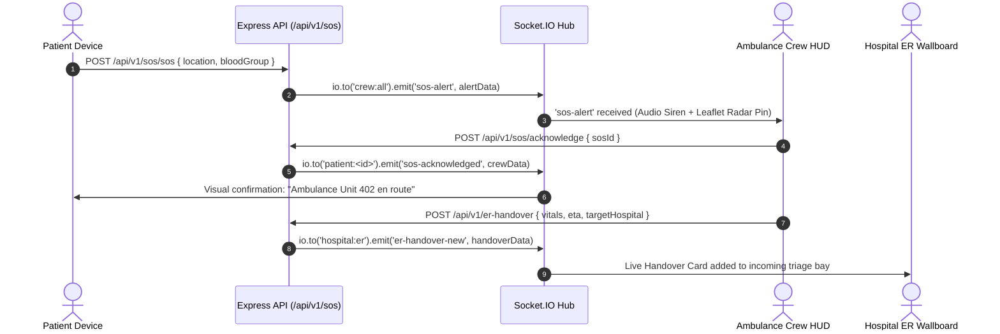

# 🏛️ Architecture & System Design — LifeQR

**System Architecture Document**  
**Version:** 2.0  
**Stack:** Node.js (v18+), Express (v4), Socket.IO (v4), MongoDB Atlas / Mongoose (v7+), Tailwind CSS, Vanilla JS (ES6+), Leaflet GIS  

---

## 1. High-Level Component Topology

```text
                                  +---------------------------------------+
                                  |            Client Devices             |
                                  | (Smartphone, Ambulance HUD, ER Board) |
                                  +---------------------------------------+
                                         /            |            \
                                        /             |             \
                 (Public Landing Site) /      (PWA / App)      \ (Emergency Scan)
                                      v               v               v
                             [website/index.html] [app/*.html] [emergency_access.html]
                                      \               |               /
                                       \              |              /
                                        v             v             v
                         +--------------------------------------------------------+
                         |             LifeQR Express HTTP API & Server           |
                         |                   (backend/server.js)                  |
                         |  - Helmet CSP (Dev LAN friendly)  - Cookie Parser      |
                         |  - Dynamic CORS (LAN & Origin)    - Rate Limiters      |
                         |  - Public DNS Resolver Bootstrap (8.8.8.8, 1.1.1.1)    |
                         +--------------------------------------------------------+
                                        /             |            \
                                       /              |             \
                   (REST API v1 Pipeline)             |         (Socket.IO Real-Time Engine)
                                     /                |              \
                                    v                 |               v
                   +------------------------+         |       +-------------------------+
                   |  Route Handlers (v1)   |         |       | Rooms:                  |
                   |  - /auth               |         |       | - crew:all              |
                   |  - /patientProfile     |         |       | - patient:<id>          |
                   |  - /sos                |         |       | - hospital:er           |
                   |  - /emergency          |         |       | - sos:<sosId>           |
                   |  - /doctor-access      |         |       +-------------------------+
                   |  - /er-handover        |         |                   |
                   |  - /hospitals          |         |       (Live Push / Telegram / Siren)
                   |  - /ai-clinical        |         |                   v
                   +------------------------+         |       [On-Duty Crew Terminals]
                                |                     |
                                v                     |
                   +------------------------+         |
                   | Unified Patient Resolver|        |
                   | (qrCodeId, tokenHash,  |<--------+
                   |  hexToken, ObjectId)   |
                   +------------------------+
                                |
                                v
                   +------------------------+
                   | MongoDB Atlas Database |
                   | (Mongoose Schemas)     |
                   +------------------------+
```

---

## 2. Directory Architecture & Separation of Concerns

LifeQR maintains a strict physical and logical boundary between public presentation and secure operational applications:

```text
lifeqr-complete/
├── website/                  # Public marketing & presentation landing pages
│   ├── index.html            # Main product showcase & feature demonstration
│   ├── landingpage.html      # Canonical Swiss Brutalist high-contrast design showcase
│   ├── 404.html              # Branded not found page
│   ├── dist/                 # Compiled Tailwind distribution CSS
│   ├── js/ & css/            # Frontend runtime modules & styles
│   └── LifeQR.png            # Static brand logo assets
│
├── app/                      # Authenticated medical & emergency web portals
│   ├── patient_app.html      # Mobile MVP PWA application (Splash, Login, Signup, OTP, Home)
│   ├── patient_dashboard.html# Patient desktop health profile, records & QR management
│   ├── CrewAmbulance_dashboard.html # Paramedic HUD (Live radar, camera scanner, SOS receiver)
│   ├── doctor_dashboard.html # Doctor clinical workstation with AI Copilot & Scribe
│   ├── er_dashboard.html     # Hospital emergency room triage wallboard & handover stream
│   ├── hospital_dashboard.html# Hospital bed allocation, blood vault, staff roster
│   ├── admin_dashboard.html  # System administration, document approvals & audit viewer
│   ├── emergency_access.html # Zero-login emergency medical badge viewer
│   ├── api-utils.js          # Unified API fetch wrapper, auth helpers & dynamic base URL
│   ├── qr-scanner.js         # Browser camera QR decoder with jsQR engine
│   └── js/                   # Dedicated client controllers for each dashboard view
│
├── backend/                  # Node.js Express REST API & WebSocket server
│   ├── server.js             # Main server entrypoint, middleware, static hosting & Socket.IO
│   ├── routes/v1/            # Modular REST route handlers (14 dedicated controllers)
│   ├── models/               # 18 Mongoose ODM database schemas
│   ├── services/             # Background services (emailService, securityLogger, notifications)
│   ├── utils/                # Helper utilities (patientResolver, frontendUrl, tokenGenerator)
│   └── middleware/           # Auth validation (authenticateToken, requireVerified, rateLimiter)
│
├── scripts/
│   └── sync-frontend.js      # Automatic two-way mirror synchronization engine
│
├── brain/                    # Persistent AI agent intelligence & memory records
└── docs/                     # Comprehensive project documentation
```

### The Two-Way Frontend Synchronization Engine (`scripts/sync-frontend.js`)
Because `website/` and `app/` share common identity components (stylesheets, branding images, `api-utils.js`, `theme.js`, authentication forms), running `npm run sync` or starting the development server activates `scripts/sync-frontend.js`. It performs:
- Timestamp comparison between mirrored files.
- Automated bidirectional synchronization so edits made in `app/` propagate to `website/` and vice versa.
- File system watching via `npm run sync:watch` for zero-lag local developer ergonomics.

---

## 3. Backend HTTP & WebSocket Infrastructure

### Middleware Pipeline Order (`backend/server.js`)
1. **Public DNS Fallback:** Sets `dns.setServers(['8.8.8.8', '1.1.1.1'])` prior to connecting to MongoDB Atlas to bypass restrictive local router SRV resolution bugs.
2. **Helmet Security Headers:** Configured with custom Content Security Policy (CSP). Allows WebSockets (`ws://`, `wss://`), Leaflet OpenStreetMap tiles, and disables `upgradeInsecureRequests` during local development so LAN mobile devices over HTTP (`http://192.168.x.x:5000`) do not fail.
3. **Dynamic CORS:** Uses dynamic origin reflection (`origin: true`) with `credentials: true` to support cross-port testing (e.g., Live Server on port 5500, Vite dev servers) while enforcing strict HTTP-only cookie transfer.
4. **Body Parsers:** `express.json({ limit: '15mb' })` and `express.urlencoded({ extended: true, limit: '15mb' })` to safely support high-resolution base64 document and medical scan uploads.
5. **Cookie Parser:** Parses incoming HTTP-only session cookies (`token`).
6. **Static Directory Serving:**
   - `/` serves `website/`
   - `/app` serves `app/`
   - `/uploads` serves verified credential attachments and patient reports.

---

## 4. REST API Specification (Version 1 — `/api/v1`)

| Endpoint Prefix | Primary Controller | Key Capabilities |
| :--- | :--- | :--- |
| `/api/v1/auth` | `routes/v1/auth.js` | User registration, login, logout, session verification (`/me`), password reset, role issuance. |
| `/api/v1/patient` | `routes/v1/patientProfile.js` | Patient profile retrieval (`/me`), profile update, QR regeneration, photo uploads, live location beacon. |
| `/api/v1/patient-app` | `routes/v1/patientApp.js` | Dedicated mobile MVP flow: phone verification, mock OTP, multi-step onboarding, emergency contacts CRUD. |
| `/api/v1/emergency` | `routes/v1/emergencyCredentials.js`| Zero-login public emergency lookup, token hash validation, access audit logging. |
| `/api/v1/sos` | `routes/v1/sos.js` | 1-Click SOS trigger, paramedic acknowledgment, stage progression (`en_route` $\rightarrow$ `resolved`). |
| `/api/v1/doctor-access` | `routes/v1/doctorAccess.js` | Patient QR search, medical history inspection, consultation creation, prescription management. |
| `/api/v1/doctor-decision`| `routes/v1/doctorDecisionTree.js` | Clinical decision tree guidelines, trauma algorithms. |
| `/api/v1/er-handover` | `routes/v1/erHandover.js` | In-transit paramedic-to-ER handover creation, vitals streaming, trauma bay reception feed. |
| `/api/v1/hospitals` | `routes/v1/hospitals.js` | Inpatient admissions, bed allocation matrix (Trauma, ICU, Wards), specialist roster, blood bank inventory. |
| `/api/v1/ai-clinical` | `routes/v1/aiClinical.js` | AI Patient Summary, Voice/Text Medical Scribe, Differential Dx, Rx Safety verification. |
| `/api/v1/verification` | `routes/v1/verification.js` | Professional credential document upload (`/upload-document`), pending application status. |
| `/api/v1/admin` | `routes/v1/admin.js` | System analytics, user registry management, document approval/rejection, security audit logs. |
| `/api/v1/history` | `routes/v1/medicalHistory.js` | Aggregated timeline of past consultations, admissions, and emergency incidents. |
| `/api/v1/reports` | `routes/v1/reports.js` | Medical scan/document upload, category tagging, and file retrieval. |

---

## 5. Unified Patient Resolver (`backend/utils/patientResolver.js`)

In emergency situations, patient identifiers can be received in multiple inconsistent formats depending on whether the scanner read a plain QR ID, an encrypted emergency URL, a direct Mongo ObjectId, or a SHA-256 token hash.

The **Unified Patient Resolver** standardizes resolution across the entire system:
```text
Input (Any of):
├── Raw QR ID: "RAH-D3200470" (case-insensitive)
├── Emergency Token Hash: SHA-256 hash stored in EmergencyCredential model
├── Direct Hex Token: Raw 64-char token string from emergency URL
├── Full URL: "https://lifeqr.com/emergency_access.html?id=RAH-D3200470"
└── Mongoose ObjectId: "66ae91b0f12c8b001a..."
               |
               v
      [patientResolver.js]
               |
               v
Returns Standardized Object:
{
  profile: PatientProfile Document,
  user: User Document,
  credential: EmergencyCredential Document (if token-based),
  qrCodeId: "RAH-D3200470"
}
```

---

## 6. Real-Time Socket.IO Architecture

Socket.IO is configured with `withCredentials: true` and supports both WebSocket and long-polling fallbacks.

### Room Subscriptions
- `crew:all`: Joined by all verified paramedic dashboards. Receives global SOS alerts.
- `patient:<userId>`: Private channel for individual patients to receive status updates on who acknowledged their SOS.
- `hospital:er`: Subscribed by hospital ER triage dashboards to receive real-time incoming ambulance handovers and ETA countdowns.
- `sos:<sosId>`: Dedicated room for an active incident, streaming live GPS updates between the patient and responding ambulance.

### Event Lifecycle



---

## 7. Database Models & Schema Design (MongoDB Mongoose)

1. **`User`**: Core authentication record (`name`, `email`, `password` (bcrypt hash), `role`: `'patient'|'crew'|'doctor'|'admin'`, `verified`, `phone`, `avatar`).
2. **`UserSecurity`**: Synchronized credential store isolated in `'user securities'` collection for administrative credential auditing and password resets.
3. **`PatientProfile`**: Comprehensive medical data linked to `userId`. Stores `bloodGroup`, `allergies` array, `medications` array, `chronicConditions` array, `emergencyContacts` array, `qrCodeId` (indexed), `publicProfile` boolean.
4. **`EmergencyCredential`**: Encrypted zero-login tokens for QR access (`tokenHash`, `qrCodeId`, `status`, `expiresAt`, `accessCount`).
5. **`EmergencyContact`**: Standalone schema for mobile onboarding (`userId`, `name`, `relationship`, `phone`, `isPrimary`).
6. **`QRProfile`**: Specialized configurations for printable badge layouts (`userId`, `badgeType`, `displayPreferences`).
7. **`MedicalRecord`**: Categorized patient documents (lab tests, radiology, discharge summaries) with file path, mimeType, and metadata.
8. **`AmbulanceCrew` & `CrewProfile`**: Paramedic unit identifiers (`vehicleNumber`, `crewType`, `station`, `organization`, `status`).
9. **`Doctor` & `DoctorProfile`**: Healthcare professional credentials (`licenseNumber`, `specialty`, `hospitalAffiliation`, `verificationStatus`).
10. **`Hospital`**: Institutional entity (`name`, `code`, `emergencyHotline`, `wards`, `beds`, `bloodBank`, `roster`).
11. **`Consultation`**: Clinical encounter record between doctor and patient (`vitals`, `diagnosis`, `soapNotes`, `differentialDx`).
12. **`Prescription`**: Digital drug orders linked to consultations (`medication`, `dosage`, `frequency`, `duration`, `safetyWarningCheck`).
13. **`SOS`**: Incident persistence (`patientId`, `location`, `status`, `assignedCrew`, `timeline`, `acknowledgedAt`).
14. **`ERHandover`**: Paramedic-to-trauma handover record (`vitals`, `gcs`, `suspectedTrauma`, `etaMinutes`, `assignedBay`).
15. **`VerificationDocument`**: Official identity and medical license files pending administrator audit (`userId`, `documentType`, `fileUrl`, `status`).
16. **`AuditLog`**: Permanent immutable compliance record (`action`, `actorId`, `targetPatientId`, `ipAddress`, `userAgent`, `timestamp`).

---

## 8. Security, Privacy & Session Architecture

- **Zero Plain-Text Exposure:** All user passwords pass through `bcryptjs` hashing. The obsolete `plainPassword` field has been permanently excised from all API payloads.
- **Dual Authentication Protocol:**
  - **Browser Dashboards:** Authenticate via secure `token` stored in `httpOnly`, `sameSite: 'lax'` cookies. Automatically verified on page navigation by `auth-guard.js`.
  - **Mobile PWA / External APIs:** Accepts `Authorization: Bearer <token>` in HTTP headers.
- **Access Control Layers (RBAC):**
  - Public Zero-Login $\rightarrow$ Emergency profile view only (ICE contacts, blood, allergies).
  - Patient $\rightarrow$ Self health record, emergency contacts, badge generation.
  - Crew $\rightarrow$ Verified paramedic scanning, SOS queue, ER handover creation.
  - Doctor $\rightarrow$ Verified clinical inspection, AI copilot, prescription issuance.
  - Admin $\rightarrow$ System stats, user role elevation, document approval.
