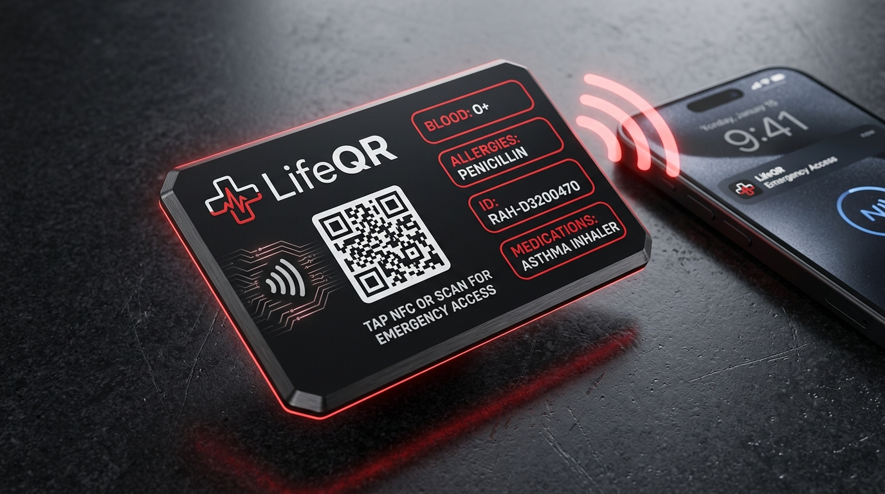

# 🪪 LifeQR Contactless Smart Emergency NFC Card

> **Instant, Contactless Medical Access During the Golden Hour.**  
> Tap any smartphone to access vital emergency health information in 0.5 seconds — zero app installation required.

---

## 📸 Product Concept & Visual Design



*Figure 1: LifeQR Smart Emergency NFC Card in Matte Obsidian & Swiss Medical Red, featuring dual-interface contactless NFC, laser-etched QR backup, and human-readable vital telemetry badges.*

---

## 🚀 Why NFC for LifeQR?

While QR codes are universally compatible, emergencies often present harsh conditions:
- **Low light or pitch black environments** (night-time vehicular accidents).
- **Physical obstructions** (scratched surfaces, dust, rain, blood).
- **Time pressure**: Unlocking a phone, opening the camera, focusing, and waiting for the URL takes 8–15 seconds.

**With the LifeQR NFC Card:**
1. **0.5-Second Access**: First responders simply touch their smartphone (iOS or Android) to the card.
2. **Zero App Required**: Standard NDEF URI records trigger the native OS NFC handler automatically opening the verified emergency medical page.
3. **Dual-Channel Reliability**: Even if NFC hardware is disabled, the high-contrast printed QR code and human-readable physical badges provide instant redundancy.
4. **Offline Emergency Telegram**: Embedded EEPROM memory stores an unalterable offline medical snapshot for subway tunnels, remote highways, and disaster zones with zero cellular connectivity.

---

## 📂 NFC Card Module Directory Structure

```text
nfc-card/
├── README.md                  # This file: Initiative overview & quickstart
├── IDEAS_AND_FEATURES.md      # Comprehensive feature matrix & future innovations
├── ARCHITECTURE.md            # Hardware specs, NDEF layouts, Web NFC & crypto verification
├── demo-simulator.html        # Interactive browser simulator with sound & tap emulation
├── assets/
│   └── nfc-card-showcase.jpg  # Photorealistic 3D render of the physical card
└── schemas/
    ├── nfcCard.schema.json    # JSON Schema definition for card provisioning
    └── NfcCard.js             # Mongoose Model for database integration
```

---

## ⚡ Quick Architecture Highlights

- **Chip Compatibility**: NXP NTAG216 (888 bytes user memory) or NTAG424 DNA (AES-128 SUN cryptographic authentication).
- **Operating Frequency**: 13.56 MHz (ISO/IEC 14443 Type A, NFC Forum Type 2 / Type 4 Tag).
- **Universal Operating Systems**: iOS 13+ (CoreNFC background tag reading), Android 5.0+ (native system NFC service).
- **Web NFC Support**: Chromium-based mobile browsers via `window.NDEFReader` for patient card burning and updates directly from the patient dashboard.

---

## 🧪 Interactive Simulator

To experience the card tap interaction locally, open `nfc-card/demo-simulator.html` in your browser. It includes:
- Animated physical card with Swiss brutalist medical styling.
- Realistic acoustic feedback (chime & haptic vibration).
- Web NFC real-world read/write tester.
- Offline NDEF payload inspector.
